# killpvz
植物大战僵尸自动收集阳光，修改阳光

 最终效果：

1.找call大法

掏出我们的神器Cheat Enginge
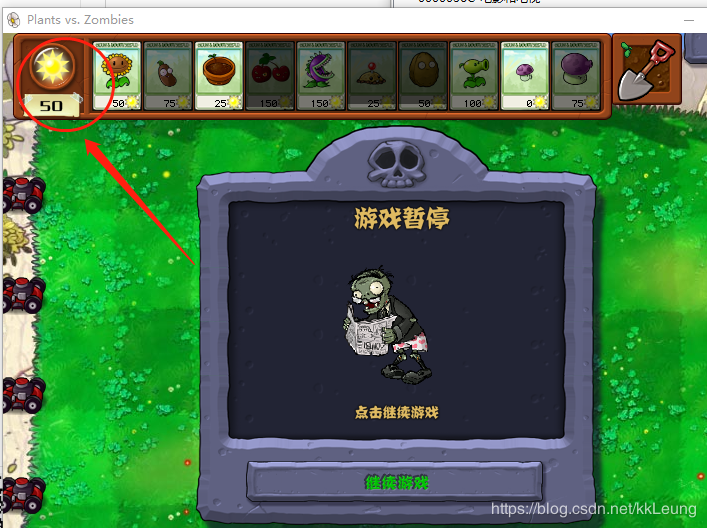
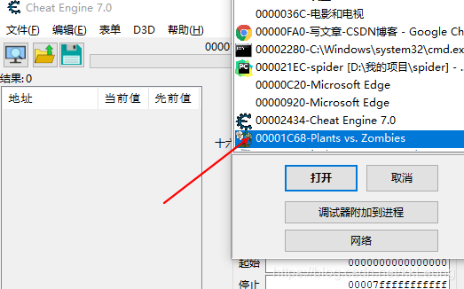
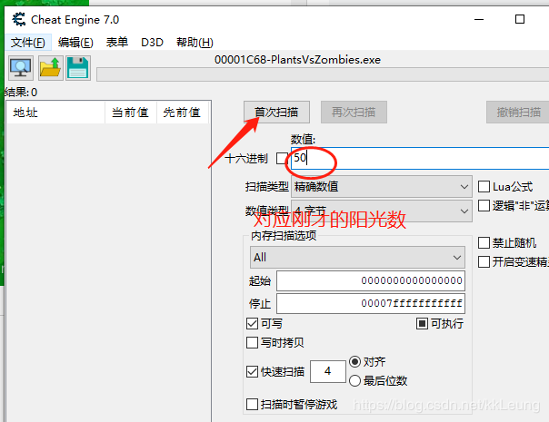
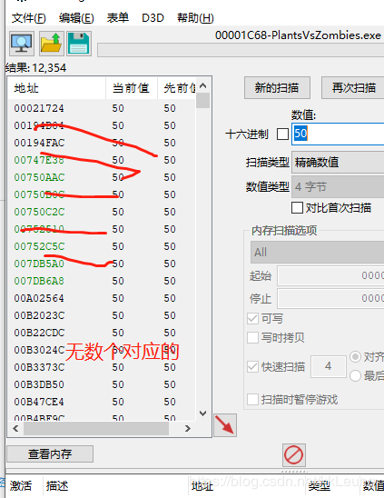

回到游戏，收集一个阳光，改变数值，然后
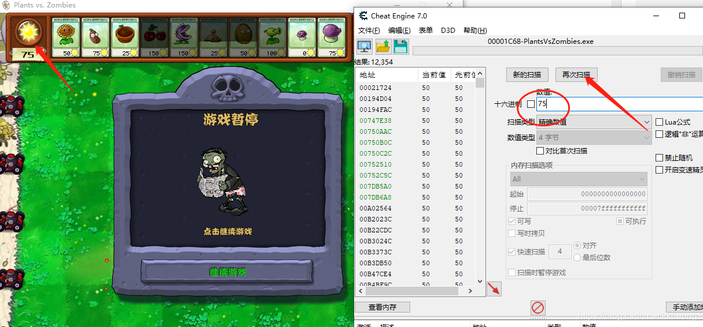

出现只配到到一个结果
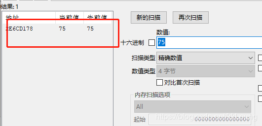

可以尝试修改地址的value，改变阳光
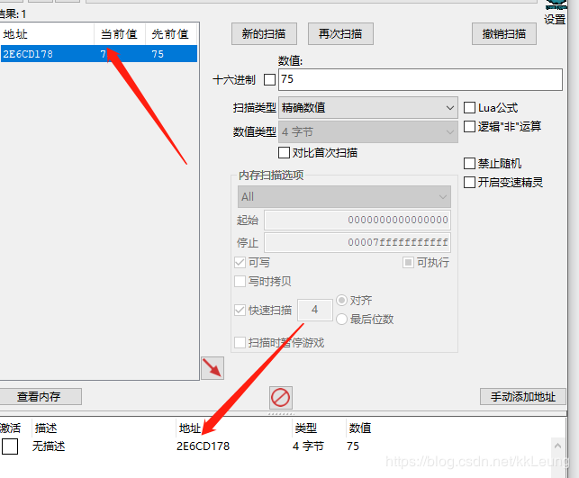

双击地址就添加到下面区域，修改下面地址的数值就可以改变阳光
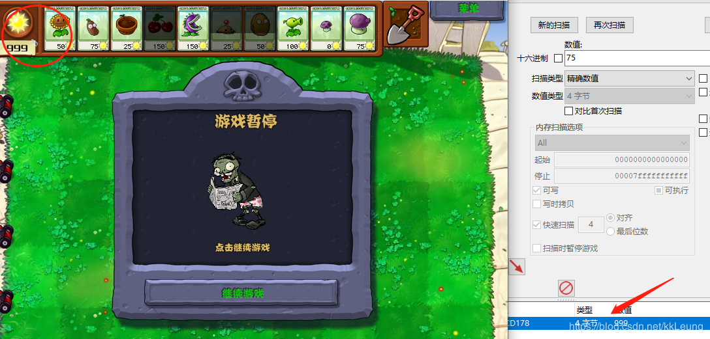

找到这个地址，只是临时的偏移量，每局重开，就会变化，不满足使用

我们要找到最终的基址和偏移
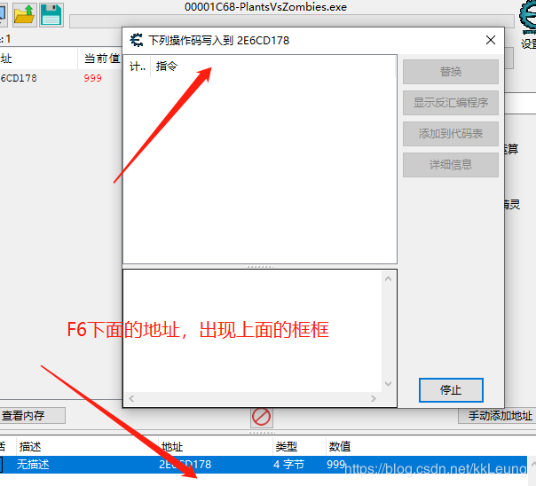

回到游戏，随便操作收集或者消耗阳光，使数值变动，ce就会看到偏移地址
记录5578，和2E6C7C00,继续走。。！~~
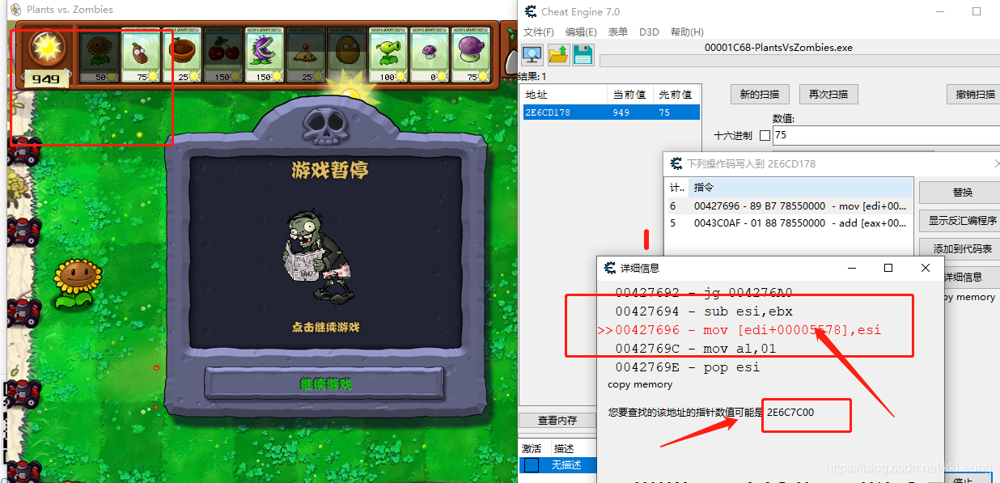

找到868 ，02879D30
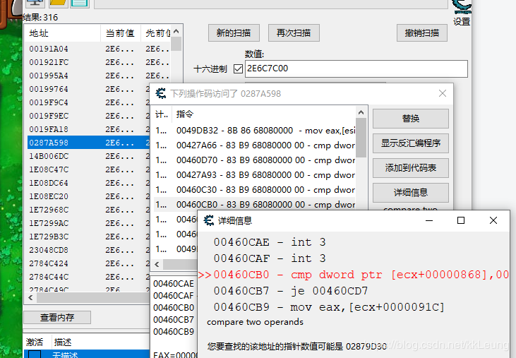

绿色的是基址
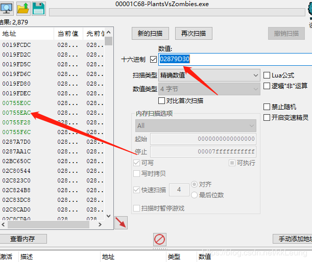
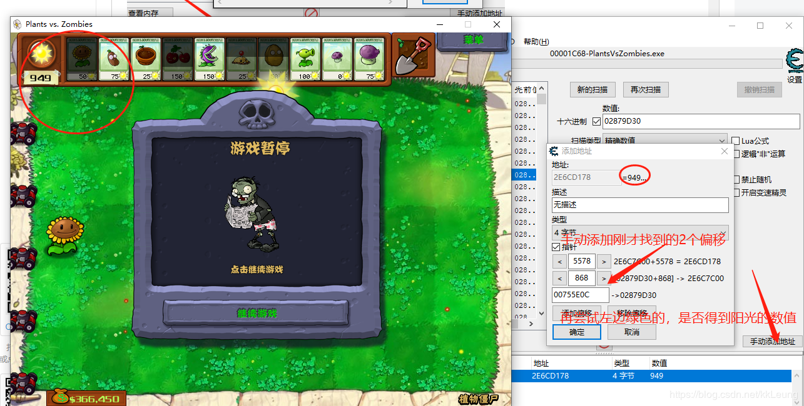

明显00755E0C是我们要找~~~！！

---
接下来我们找自动收集的call
同理
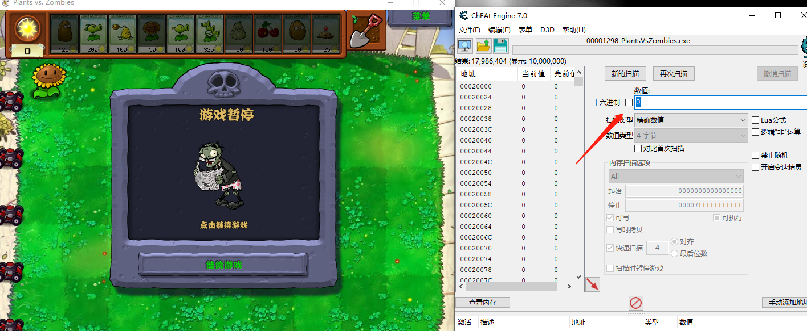
点击阳光搜1，不点击搜0 ，
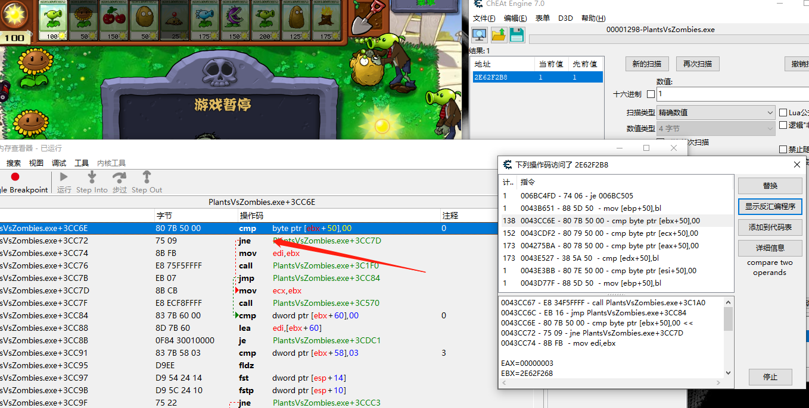
找到jne改jmp测试，成功！

使用python代码，修改相关的基址就可以使用！